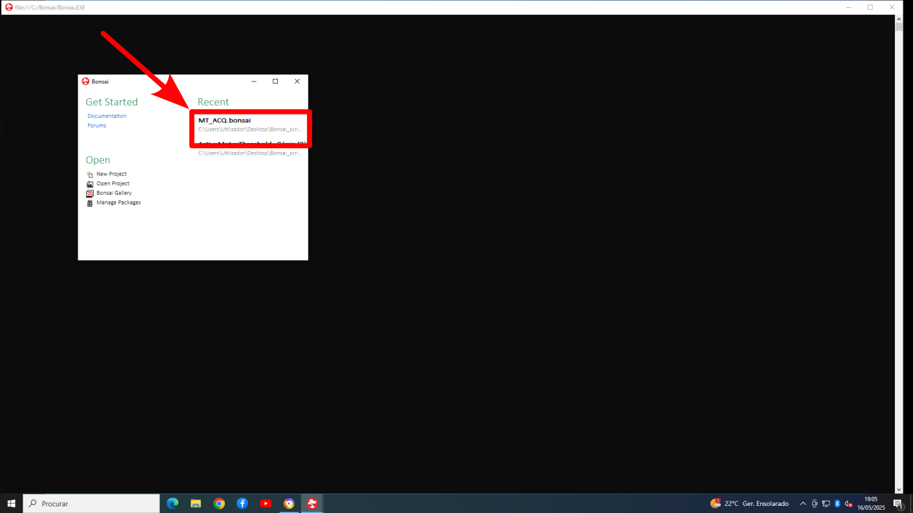
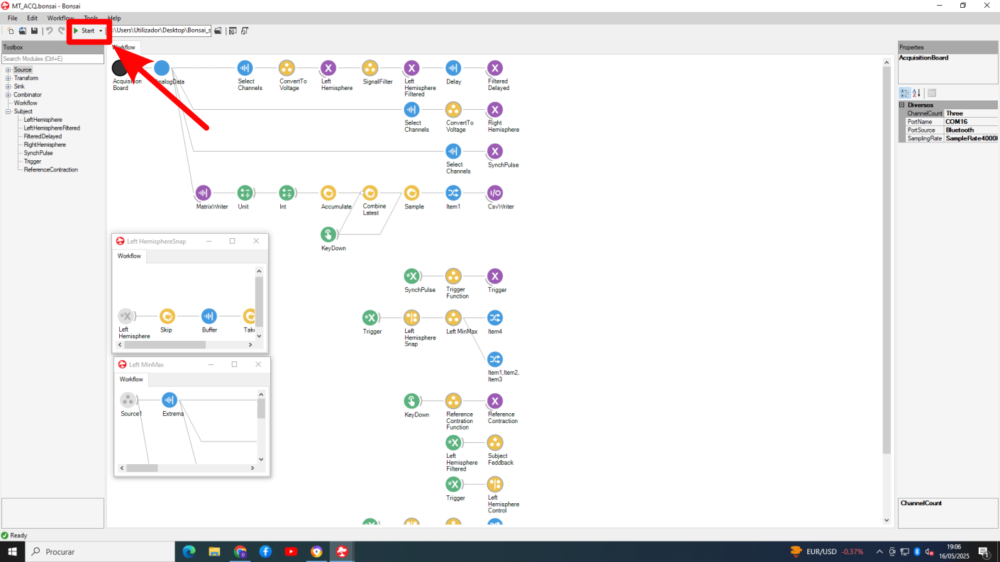
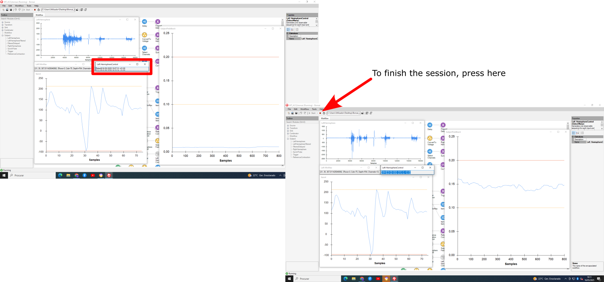

# TMS-EMG Acquisition Workflow

This repository contains a **Bonsai workflow for acquiring electromyography (EMG) signals during transcranial magnetic stimulation (TMS)**.  

The workflow relies on an **in-house built acquisition system** developed by the [Champalimaud Foundation Hardware Platform](https://harp-tech.org/) and validated against a commercial EMG device (see Supplementary Material in *Faro Viana et al.* for details). The hardware system can be requested directly through [Harp Tech](https://harp-tech.org/).  

---

## Setup Instructions

1. **Install Bonsai**  
   Download and install the [Bonsai software](https://bonsai-rx.org/).  

2. **Install the acquisition system package alongside all other required packages**  
   - The required package is included in the [`acqboard_package`](./acqboard_package) folder.  
   - It is also available at:  
     - [Neuro-Archive: Bonsai.ChampalimaudHardware/AcqSystem](https://github.com/bonsai-rx/neuro-archive/tree/main/Bonsai.ChampalimaudHardware/AcqSystem)  
     - [NuGet: Bonsai.ChampalimaudHardware](https://www.nuget.org/packages/Bonsai.ChampalimaudHardware)  

3. **Load the workflow**  
   Open Bonsai and load the workflow file included in this repository to start EMG acquisition.  

---

## Step-by-Step Guide for EMG Acquisition

<strong>1.1 Open Bonsai</strong>

Open the **Bonsai** software and select the file containing the script for EMG data acquisition.  

<strong>1.2 Start the Script</strong>

Once all the preparations for the sessions are concluded, proceed to **start the script**.  

<strong>1.3 Determining the active motor threshold</strong>

After performing MVICs, three lines will appear in the right-hand side window:

- Instruct the participant to perform the movement described in **3.4.1**  
- The **blue line** should be placed in between the **yellow** and **orange** ones  
- Once a pulse is applied, the consequent EMG is valid **if the word “True” appears on the screen** (see red box in the picture below)  
- Otherwise, the results of the pulse should not be considered  

---

## Reference

Faro Viana F, et al. Reducing motor evoked potential amplitude variability through normalization. Front Psychiatry. 2024;15:1279072. doi:10.3389/fpsyt.2024.1279072

